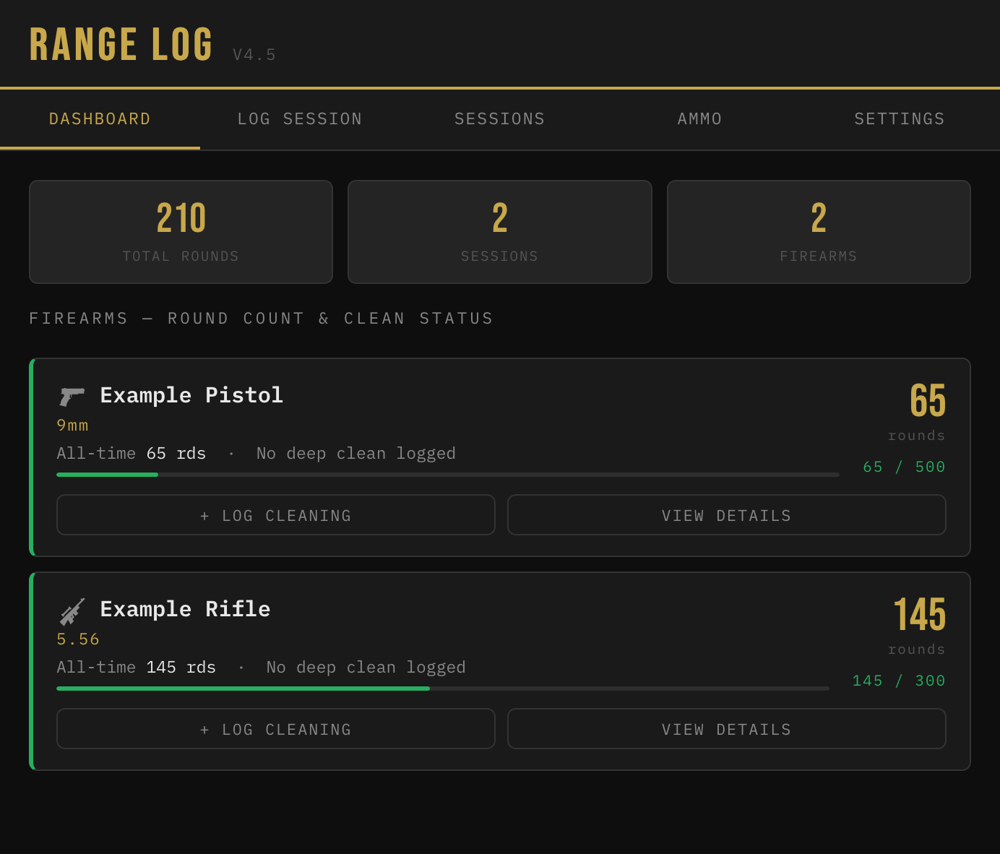

# Range Log
A simple, private tracker for your range sessions — built as a lightweight web app you can install on your phone like a native app, with no account, no ads, and no data ever leaving your device.

**Tracks:**
- 🔫 Firearms — type, caliber(s), round counts, and clean-interval thresholds
- 📅 Range sessions — date, location, rounds fired per firearm, notes
- 🧼 Cleaning history — quick / deep / detail-strip, with automatic round-count resets
- 🎯 Zeros — distance, ammo, optic, and notes per firearm
- 💵 Ammo purchases — cost per round, seller, stock status, with running averages

All data is stored locally in your browser (nothing is sent to a server), and can be exported/imported as JSON for backup or moving between devices.

## Screenshots

## Access via Web
https://shawnlefebre.github.io/range-log/

## Installing on iPhone (Home Screen App)

1. Open the hosted URL (see above or your own if [hosting your own](#hosting-your-own-copy-github-pages)) in **Safari** — not Chrome or another browser, since only Safari supports adding web apps to the home screen on iOS
2. Tap the **Share** button (square with an arrow pointing up)
3. Scroll down and tap **Add to Home Screen**
4. Confirm the name and tap **Add**
5. Launch the app from its new home screen icon going forward — it'll behave like a native app (full screen, no browser bar)

**Note on updates:** Range Log checks for new versions automatically each time you open it. When an update is available, a banner appears at the bottom — tap it to reload with the latest version. If you don't see a banner, your app already has the newest version.

**Note on data:** All your data (firearms, sessions, ammo, etc.) is stored locally in your browser/device — nothing is sent to a server. This means:
- Data does **not** sync automatically between devices (e.g. iPhone and Mac)
- Use **Settings → Export JSON** periodically to back up your data
- Use **Settings → Import JSON** to restore a backup or move data to another device

## Hosting Your Own Copy (GitHub Pages)

1. **Fork this repository** (or create a new one and copy in `index.html` and `sw.js`)
2. Make sure the repo is **public** — GitHub Pages requires this on free accounts
3. In your repo, go to **Settings → Pages**
4. Under **Source**, select the **main** branch and **/ (root)** folder, then **Save**
5. Wait about a minute, then your app will be live at:
   `https://YOUR-USERNAME.github.io/YOUR-REPO-NAME/`

**Important:** both `index.html` and `sw.js` must sit in the same folder (repo root) for the app to auto-update correctly. If you rename or move one, update the other's references to match.

