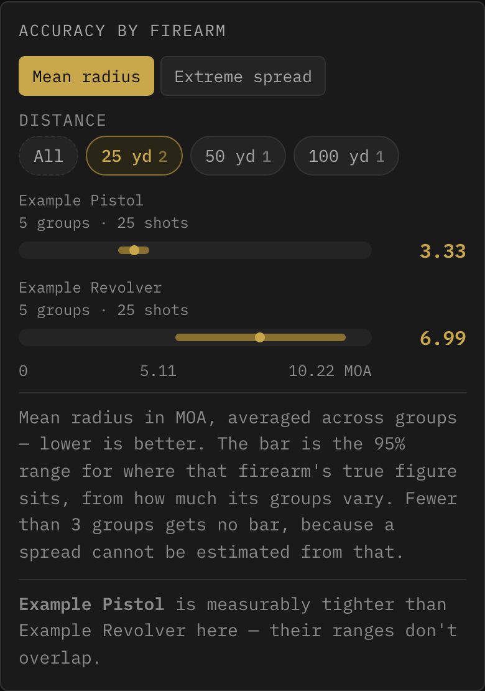

# Range Log

A simple, private tracker for your range sessions — a lightweight web app you can install on
your phone like a native app, with no account, no ads, and no data ever leaving your device.

**[Open Range Log →](https://shawnlefebre.github.io/range-log/)** — or [host your own copy](#hosting-your-own-copy-github-pages).

**Tracks:**
- 🔫 Firearms — type, caliber(s), round counts, and clean-interval thresholds
- 📅 Range sessions — date, location, rounds fired per firearm, notes
- 🧼 Cleaning history — quick / deep / detail-strip, with automatic round-count resets
- 🎯 Zeros — distance, ammo, optic, and notes per firearm
- 🎯 Target groups — photograph a target, mark the shots, get group size in inches, MOA and MRAD
- 📐 Dope tables — come-ups per firearm and load, entered by hand, in MOA or mils
- 💵 Ammo purchases — cost per round, seller, stock status, with running averages
- 📊 Stats — group analysis, rounds fired, ammo spend and cleaning status, filterable by time range, firearm, caliber, and location

All data is stored locally in your browser. Nothing is sent to a server, and everything can be
exported and imported as JSON for backup or moving between devices.

## Contents

**Getting started** — [Screenshots](#screenshots) · [Installing as an app](#installing-as-an-app) · [First launch](#first-launch)

**Using it** — [Firearms and sessions](#firearms-and-sessions) · [Group analysis](#group-analysis) · [Stats](#stats) ([Groups](#groups), [Money](#money)) · [Dope tables](#dope-tables) · [Text size](#text-size)

**Reference** — [Reading the numbers](#reading-the-numbers) · [Reading the bar charts](#reading-the-bar-charts) · [Photo storage](#photo-storage) · [If your saved data can't be read](#if-your-saved-data-cant-be-read)

**For developers** — [Hosting your own copy](#hosting-your-own-copy-github-pages) · [Development and testing](#development-and-testing)

## Screenshots





*(Taken on v7.7 against the app's built-in [demo data](#first-launch), so nothing here is
anyone's real record.)*

## Installing as an app

Hosted at **https://shawnlefebre.github.io/range-log/** — or use your own URL if you're
[hosting your own copy](#hosting-your-own-copy-github-pages).

**iPhone or iPad.** Open the URL in **Safari** — only Safari can add web apps to the iOS home
screen. Tap **Share**, then **Add to Home Screen**, then **Add**. Launch it from the new icon
and it runs full screen, with no browser bar.

**Android or desktop.** Open the URL in Chrome or Edge and use **Install app**, in the address
bar or the ⋮ menu. Same standalone window.

**Updates** are automatic: the app checks on every launch and shows a banner at the bottom when
a new version is ready. Tap it to reload. No banner means you're up to date.

**Your data lives on the device:**

- It does **not** sync between devices — your phone and your Mac keep separate records
- **Setup → Data → Export JSON (backup)** is your backup. Do it periodically
- **Setup → Data → Import JSON backup** restores one, or moves your data to another device
- **Setup → Danger Zone → Delete All Data** wipes everything, and asks you to type DELETE first because there's no undo

**Export CSV** sits beside the JSON button and does a different job: your sessions as a
spreadsheet — date, location, firearm, caliber, rounds, notes, one row per firearm per session.
It's for reading elsewhere, not for backup. Nothing imports it back, and it covers only
sessions. The JSON is the file to keep.

## First launch

The app opens pre-loaded with a year of sample data — firearms, sessions, cleanings, ammo,
target groups and zeros — so every screen has something in it before you've entered anything of
your own. The sample rifle's groups span the year at two distances with a mid-year re-zero, and
the handguns share a distance, so the trend, comparison and point-of-impact charts all have real
work to do.

A banner on the Dashboard offers **Clear & Start Fresh** to wipe it, or **Keep This Data** if
you'd rather edit the samples into your real setup.

Demo data is regenerated fresh each time and dated relative to today, so it never shows a
session in the future. To get it back later, **Setup → Danger Zone → Load Demo Data**. It
replaces everything currently stored, so it asks you to type `DEMO` first unless the app is
already empty.

---

## Firearms and sessions

**Log** records a range trip: date, location, rounds fired per firearm, and a note. Those rounds
accumulate against each firearm's round count, which drives the clean reminder on the Dashboard.
**Sessions** lists every trip; one with groups attached shows a scorecard of what you shot.

Cleanings are logged per firearm as **quick**, **deep** or **detail-strip**, and reset the
rounds-since-clean count. Zeros record distance, ammo, optic and notes.

**View Details** on a firearm gathers its cleaning history, zeros, dope tables and groups in one
place. Each list shows its most recent few with the rest behind a **Show all** count, and
expanding one scrolls inside its own panel rather than stretching the modal.

Tapping a zero, dope table, group or ammo purchase opens it **read-only** — the fields are
inert, so a stray tap can't alter what a rifle is actually zeroed at. The pencil opens it for
editing.

## Group analysis

**View Details → Groups → + Add Group** measures a target from a photo:

1. Take or choose a photo of the target
2. Mark a **known distance** on it — one square of a 1-inch grid, say — to set the scale
3. Mark your **point of aim**, then the center of each hole

You get group size (extreme spread), mean radius, width and height, and how far the group sits
from your point of aim, in inches, MOA and MRAD. The reticle is drawn at your bullet's true
diameter as you mark, so it sits over the hole like a lid. For which figure to trust, see
[Reading the numbers](#reading-the-numbers).

- **Photos taken at an angle** are handled — switch the scale method to *4 corners*, mark the corners of a known rectangle in any order, and the distortion is corrected mathematically
- **The date** defaults to when the photo was taken, not when you logged it
- **Bullet diameter** comes from the ammo you select
- **Several groups on one target.** Mark the scale once, then point of aim and impacts for each group. Each saves separately but they share one stored photo, and groups you've already marked stay visible on it, dimmed
- **Fixing one bad mark.** Move the crosshair over an impact and it highlights, with a **Remove** control naming which one. Setting a point stays the primary action, so you can still add a hole right beside an existing one. Undo reverses whichever you did last
- **Tags** label a group however you like — prone, bench, bipod, windy — from tags you've used before or a new one. Matching ignores case, so *Prone* reuses *prone* instead of splitting your comparisons later
- **Groups link to a range session**, which is what gives each session its scorecard
- **Keeping the photo is optional.** Marked points are always saved, so measurements still recompute without it — you just can't re-mark impacts. Photos never leave the device and are never in a JSON export, which keeps backups small
- **A target photographed once is stored once.** The image is deleted only when the last group referencing it lets go
- **If a photo goes missing** — a backup restored without its photo bundle, say — the group says so and offers to restore it. Impacts are stored relative to the image, so putting the same photo back lines the marks up exactly, and restoring repairs every group that shared that target at once

## Stats

Four sub-tabs, one shared filter bar:

- **Groups** — per-firearm shooting analysis; three charts, [below](#groups)
- **Practice** — rounds fired and range trips over time, by firearm, caliber and location
- **Money** — ammo spend, cost per round, spend by store, what shooting costs, and how fast you burn each chambering
- **Upkeep** — rounds since the last deep clean against each firearm's threshold, worst first. Amber past 80%, red past due, always with the number and the word beside it so the state never depends on color alone

The filter bar — time range, location, firearm, caliber — drives all four panes. A filter that
can't apply to the pane you're on is dimmed and disabled with a line saying why: purchases record
a *seller* rather than a range, so Location is inert on Money; "rounds since clean" is a fact
about now, so Time Range is inert on Upkeep.

### Groups

Scoped to one firearm at a time, since a rifle at 50 yd and a pistol at 25 ft aren't on the same
scale. Three charts, all driven by the chips above them.

**Group size over time.** Every group is plotted faintly; the bold line joins each range day's
**median**. The faint vertical bar is that day's best-to-worst spread — a trend is real when the
medians move further than those bars are tall. One afternoon with the same rifle and load can
span 3× from best to worst, so a line through individual groups would show trends that are
nothing but noise.

Tapping a point opens that **range day**: location, your session note, the day's groups
tightest-first with the best marked, and a way through to the full session. It's keyed on the
date rather than the session, so a group you never linked still shows up. Two figures sit at the
top — **rounds logged** is what you recorded for that firearm that day, **shots measured** is
what's actually in the groups below.

**Re-zero marks are always drawn**, whatever time range you're on, because point of impact before
and after a zero aren't the same measurement. The time range picker offers your zeros as anchors:
**Since last zero**, and each earlier one. Groups dated the same day as a zero count as *after*
it.

**Comparing firearms.** Leave the firearm filter on **All Firearms** and the pane compares them
instead. Each sits at its mean radius in MOA, averaged across its groups, with a bar showing the
95% range for its true figure — derived from how much its own groups vary, not from how many
shots you fired.

It won't rank a firearm with **fewer than three groups** — two can agree by luck, and no spread
can be estimated from them — so those show a figure, no bar, and take no part in the comparison.
When two bars overlap it says **too close to call** rather than presenting an order the data
doesn't support. More groups narrow the bars.

Pin the distance first: a handgun at 25 ft and a rifle at 50 yd differ by discipline long before
they differ as firearms. With more than one distance in scope, the view says so and offers chips
to narrow it.

**Narrowing what's in play.** Three rows of chips — **ammo**, **distance**, **tag** — drive all
three charts. Several within a row mean *or*; across rows means *and*, so *55gr FMJ* plus *50 yd*
is "that load at that distance," which is where a zero actually lives. A row appears only when it
has more than one value to offer.

Each chip carries the number of groups you'd get **if you clicked it**, not how many exist — pick
100 yd and the ammo counts redraw to what's available there. Empty combinations are dimmed rather
than offered. Selections belong to the firearm you're on and reset when you switch.

**Comparing groups** puts a **Compare by** control over one chart: ammo, tag, range day or
distance. One dot per group, a median tick, the spread as a bar — prone versus bench is the same
question as one load versus another, so it's one view rather than three.

Each option shows how many buckets it would split into — *Ammo (3), Tag (1)* — so you can see
which comparisons are worth making. Land on a dimension with one bucket and it names the ones
that aren't, as chips that switch the control for you. It also warns when **every bucket comes
from one range day**, since then you're comparing afternoons rather than tags, and when **a group
appears in more than one row**, which happens with tags because they're multi-valued and the
counts won't add to your total.

Distances are normalized first, so 25 ft and 8.333 yd are one bucket.

**Point of impact** answers the other half: not what the firearm can do, but whether it's pointed
where you think. Each dot is one group's *center* relative to your aim, with rings marking
distance out from it — spaced from how far the dots actually sit, so a tight rifle still gets a
scale to read against.

It's colored by whatever **Compare by** is set to, with a cross at each row's median, so the two
charts read together. Beyond four rows it stops coloring, since the palette is validated for four
series against the dark background and a fifth would fail colorblind separation; the whole set
then gets one cross, so the typical point of impact is always drawn.

Underneath, it states in words where things sit — *"typical center is 0.6 MOA high and 0.3 MOA
right of aim across 23 groups"*. That sentence and the rings both read in the firearm's own
[optic adjustment unit](#reading-the-numbers).

It flags two situations. **More than one distance in scope**: offsets are angular, so mixing
distances is fine in principle, but a wrong come-up at 100 drags the median and reads as a zero
problem at 50. **A re-zero inside your time range**: averaging across one gives a number
describing neither side of it. Anchor the time range to a zero to read them separately.

### Money

**Cost per trip.** Every range trip carries an estimated cost, on the session card and ranked
here, most expensive first or flipped to find a cheap afternoon. Each row lists the firearms,
round counts and session note behind the figure; tapping it opens that session. The per-round
rate beside each trip explains the spread, since a rimfire afternoon and a centerfire one cost
very different money for the same round count.

Trips are priced from the ammo you'd bought **by that date**, so buying expensive ammo today
never changes what last March cost. A trip predating every purchase of what was shot falls back
to the earliest price on record and is marked `≈`.

**Cost of shooting is not total spend.** Total spend is what left your wallet; this is what went
downrange — rounds fired times the price of range ammo for that chambering, ranked by firearm.
It's an estimate: rounds are logged per firearm and purchases per caliber, so there's no knowing
which box a round came from. Rounds whose chambering has no logged ammo are reported, not
dropped.

**Burn rate is not inventory** either. It's rounds actually fired, from your session log. What's
left on the shelf can't be computed, since ammo bought before you started logging was never
recorded. Each chambering is divided by **its own window**: a rifle bought three months into a
twelve-month view is measured over those three months, while a caliber you owned before the
window opened is measured across all of it, dormant months included. Each row states its span.

Other things worth knowing:

- **The caliber picker offers individual calibers and, separately, shared chambers.** A rifle chambered .223/5.56 can't have its rounds attributed to one or the other, so the merged entry exists for the shooting views — but a purchase names exactly one caliber, so here you pick the one you mean
- **Filtering money by firearm is an inference.** Purchases are logged per caliber, never per firearm, so picking a rifle shows spend on the calibers it uses — including ammo you put through something else chambered the same way. The screen says so
- **Burn rate groups by whole chambering**, so a .357/.38 revolver counts once. Rounds are logged per firearm, and which of the two it fired has no answer
- **Carry ammo can be marked "not range ammo"**, unchecked by default. It's then left out of the cost of shooting and of per-round comparisons between stores, but stays *in* the Ammo Spend totals — so spend ÷ rounds bought still equals the average shown beside them
- **Where a store sold you both**, its row shows both prices — *$0.28/rd range · $0.34/rd all-in*. The round count beside a price is always the one it was computed from
- **Spend by store withholds price per round until one caliber is in scope**, since a shop that only ever sold you 12 Gauge would look expensive beside one selling bulk 9mm
- **Marking a lot used up records when.** The date is set the first time and kept if you toggle back to in stock, so correcting a mis-tap doesn't restamp it as today. It's editable, and blank is allowed. The Ammo tab filters **In stock only** (default), **Used up only**, or **All**

## Dope tables

**View Details → Dope → + Add Table** records the come-ups for a load: one ammo, one zero
distance, and a list of distances with the elevation to dial for each.

**The app does not calculate ballistics.** The numbers come from whatever solver you already
trust; this stores them and lets you correct them once you've actually shot the distance. Logged
group data never adjusts your table.

- **The unit is per table, and switching it converts the numbers** — 6.0 MOA becomes 1.75 mil, not 6.0 mil. New tables start in the firearm's turret unit
- **The distance unit is set once** at the top, so each row is just two numbers
- **Conditions are a note to yourself**, not a model. Dope drifts with altitude and temperature, and recording that these came from 900 ft at 70°F is what stops you trusting them somewhere they don't apply
- **The card shows six distances**, then a count of the rest

## Text size

**Setup → Display → Text size**, four steps from Normal to Largest. It scales the whole app
together — headings, labels, numbers, charts — so hierarchy is preserved rather than one tier
growing while the rest stays put.

The default is **Large**: the app originally rendered its typical text around 11px, and Large puts
that nearer 14px. It's stored per device rather than in your backup, since it describes this
screen and these eyes, not your shooting record.

---

## Reference

### Reading the numbers

**Group size (extreme spread)** is the conventional figure — the distance between the two
farthest holes, center to center. It uses only two shots and ignores the rest, so it grows with
round count: from the same rifle, a 5-shot group runs roughly 25% larger than a 3-shot, and a
10-shot roughly 55% larger. Comparing groups of different shot counts by this number flatters
whichever had fewer shots.

**Mean radius** is the average distance of each hole from the group's center. It uses every shot
and doesn't drift with sample size, which makes it the fair way to compare groups.

**Which one you're looking at is always named.** A group listed on its own leads with **extreme
spread**, because that's the figure people quote. Every chart under Stats → Groups plots **mean
radius**, because ranking loads by extreme spread would favor whichever you happened to shoot in
3-round strings. The two differ by roughly two to three and a half times and the ratio isn't
fixed, so no figure is left as a bare "MOA" — a list row reads *2.45 MOA spread* with *0.70 MOA
mean radius* beneath it.

**Why MOA rather than inches.** A 1″ group at 50 yards and a 1″ group at 100 yards are not the
same performance; the second is twice as good. MOA is angular, so it stays comparable across
distances. One MOA subtends about 1.047″ at 100 yards. Inches are still shown.

**Elevation and windage offsets** describe where the group sat relative to your aim — a zeroing
question, not an accuracy one. A tight group in the wrong place and a loose group centered on
your aim are different problems.

**Offsets follow your turret; group size doesn't.** Set a firearm's **optic adjustment unit** (MOA
or MRAD) and its offsets lead with that unit everywhere, so they read in whatever you actually
dial — all three units are shown either way. Group sizes stay in MOA whatever the optic, because
those get compared *between* firearms and need one common unit.

**Shot count is worth standardizing.** Five per group is the usual convention: enough for the
number to mean something, not so many that barrel heat or fatigue creep in. Rimfire is cheap
enough that ten is worth it. Several groups in a session tell you more than one large one,
because the spread *between* groups is where fliers show up.

**When to use 4-corner scaling.** Rotation doesn't change group size — distances between holes
don't care how the camera was held — but it does skew the elevation and windage split, which are
measured against the image's own axes. If the photo wasn't square-on and you care about offsets,
mark four corners of a known rectangle.

### Reading the bar charts

Rounds fired, range trips and ammo spend share one chart with a **y-axis and gridlines**. The
scale rounds up to a number a person would have picked — a 510-round month is drawn against a
ceiling of 600, with lines at 200 and 400 — so a bar's height means something on its own rather
than only against the tallest one. The trade is that no bar ever touches the top. Ticks use the
same formatter as the values, so the Money chart's axis reads in dollars.

**Month labels thin out instead of shrinking.** At larger text sizes, three-letter months stop
fitting side by side, so every second or third is labeled rather than reducing the type. Which
ones survive is measured against the space actually available, and every bar is still drawn — the
gridlines carry magnitude for the bars whose label was thinned away.

### Photo storage

Photos are downscaled before storing, landing around 30–100 KB each — a few range trips a month
works out to under 10 MB a year, against the gigabytes a browser gives an installed app.

**Setup → Target Photos** shows how many photos are stored, their total size, and how much room
the app has. If any are no longer attached to a group — which can happen after importing a backup
— it offers to reclaim the space.

It also reports the opposite case: groups pointing at a photo the device no longer has. These
break nothing, but they quietly remove the ability to re-mark, and finding them otherwise would
mean opening every group. They're listed one row per **target** rather than per group, since
restoring one photo repairs every group marked on it.

Because photos are left out of the JSON backup, moving them to another device is a separate step.
**Export photos** writes a bundle you import on the new device *after* restoring the JSON backup.
Importing a bundle only restores images some group actually refers to.

### If your saved data can't be read

If Range Log finds saved data on startup that it can't open — a write interrupted partway
through, say — it will **not** overwrite it. It sets a copy aside, starts you with an empty app
rather than sample data, and shows a banner offering the copy as a download. Take the download:
it's the raw text exactly as found, which is what any repair would start from.

Nothing else clears that copy, so it survives normal use. **Setup → Danger Zone → Delete All
Data** removes it along with everything else.

---

## Hosting your own copy (GitHub Pages)

1. **Fork this repository** — or create a new one and copy in everything at the repo root: `index.html`, `app.css`, `app.js`, `sw.js`, `manifest.json` and the icon files
2. Make sure the repo is **public** — GitHub Pages requires this on free accounts
3. Go to **Settings → Pages**
4. Under **Source**, select the **main** branch and **/ (root)** folder, then **Save**
5. Wait about a minute; your app will be live at `https://YOUR-USERNAME.github.io/YOUR-REPO-NAME/`

**All of it deploys together.** There's no build step, but each file is doing a job:
`index.html` loads `app.css` and `app.js`, `sw.js` handles updates, and `manifest.json` plus
`icon-*.png` are what let a phone install it with a real icon. Deploy them as a set, or you can
end up with new markup running against old code.

`icon.svg` is the source the PNGs are generated from, via `node tools/make-icons.js`. Nothing at
runtime reads it except as a favicon.

## Development and testing

The app has zero runtime dependencies and no build step — nothing in this section affects anyone
just using or hosting it.

`index.html` is markup only; `app.css` and `app.js` hold the styles and all the application code.
`app.js` is loaded as a plain script rather than an ES module, because the markup uses inline
`onclick` handlers that need global scope.

The **unit suite** uses Node's built-in test runner and `jsdom`, covering the trickier logic:
schema migrations, Stats filtering, chart bucketing, group geometry including the perspective
correction, and demo-data generation.

```bash
npm install
npm test
```

The **browser suite** covers what jsdom can't reach — canvas rendering, IndexedDB, real file
inputs, pointer gestures and layout, which is where most real bugs here have turned up. It drives
a headless Chromium against a throwaway local server:

```bash
npx playwright install chromium   # one time
npm run test:browser
```

It's kept out of `npm test` so the unit suite stays fast and CI needs no browser download. Pass a
suite name to run one on its own — `node test/browser/run.js install-check`.
