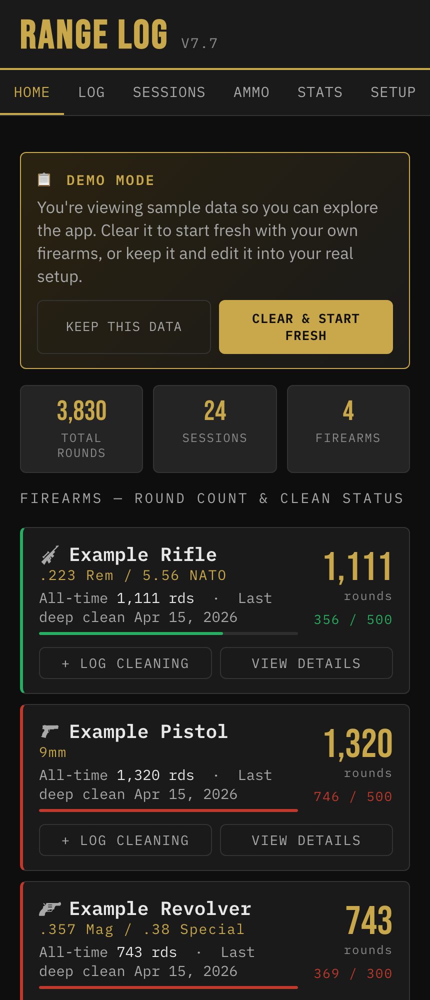
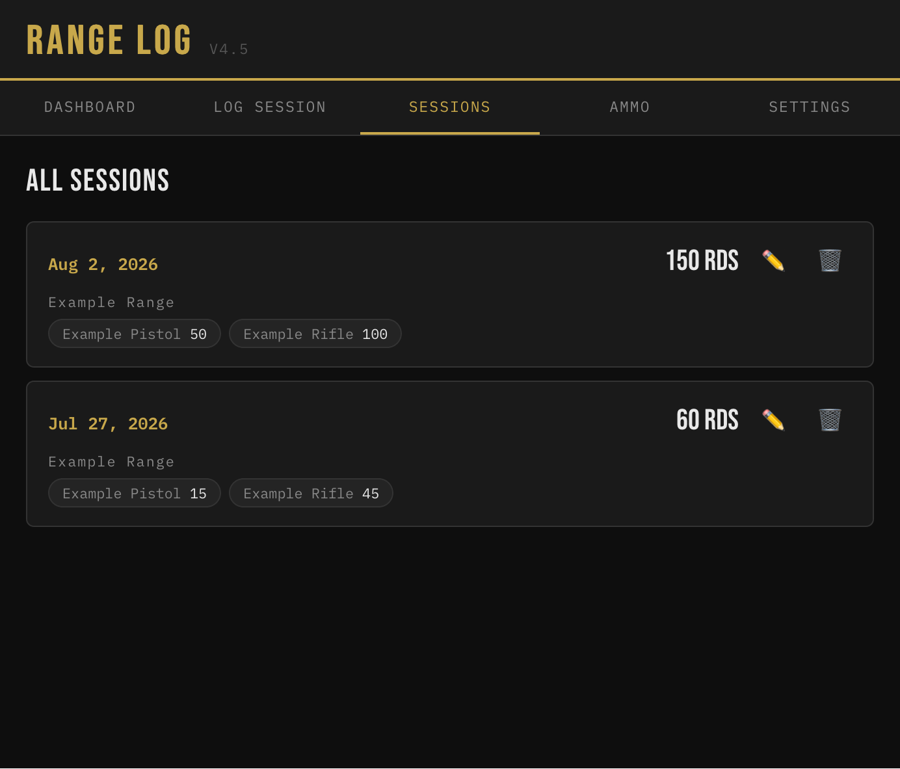
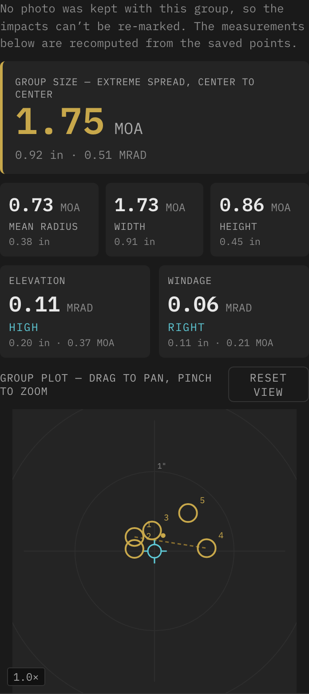
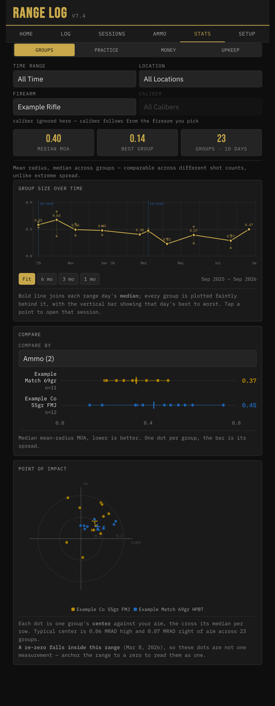
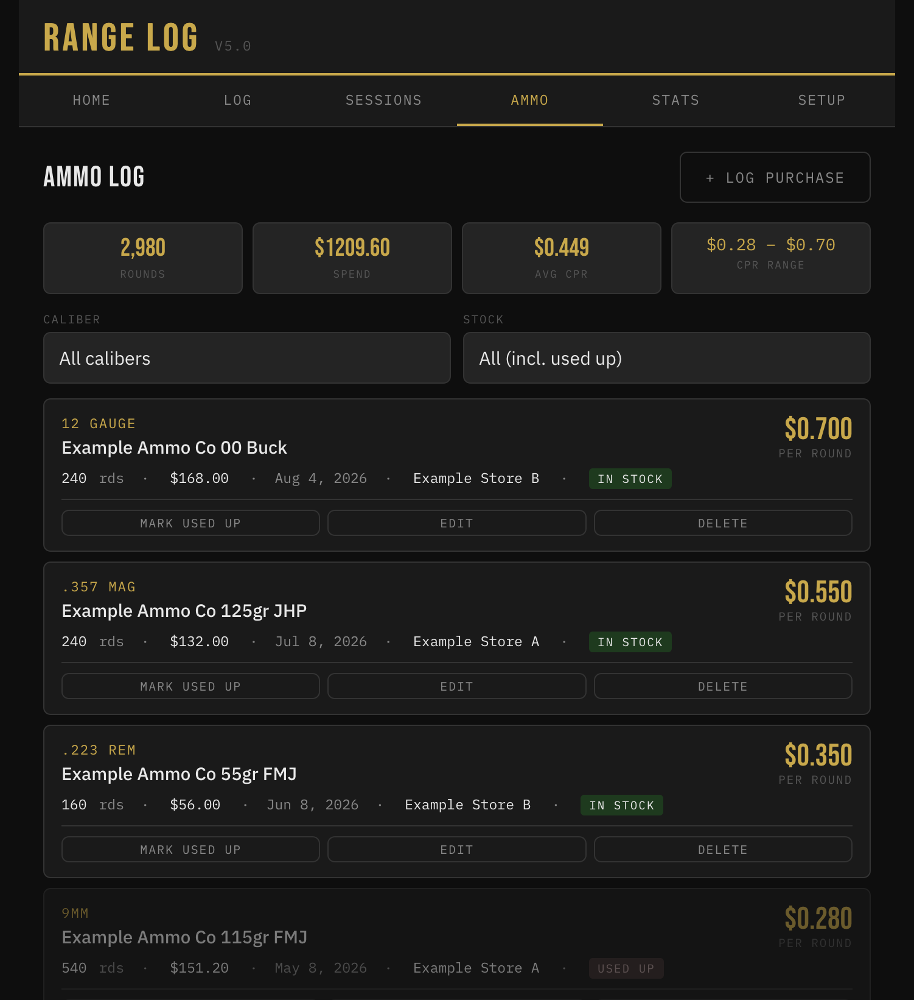
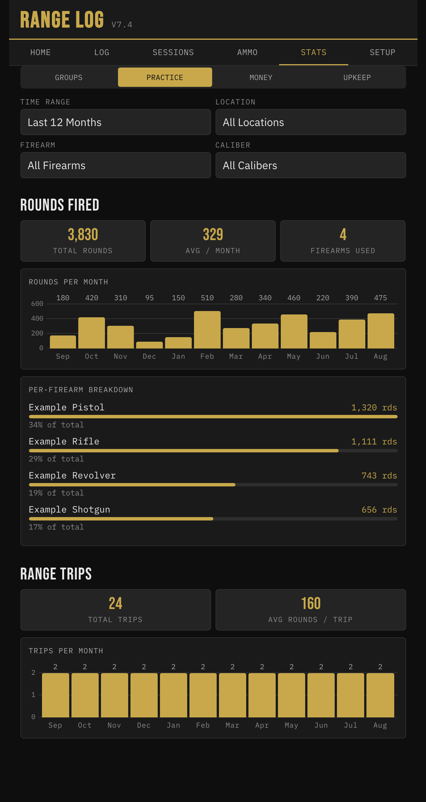

# Range Log
A simple, private tracker for your range sessions — built as a lightweight web app you can install on your phone like a native app, with no account, no ads, and no data ever leaving your device.

**Tracks:**
- 🔫 Firearms — type, caliber(s), round counts, and clean-interval thresholds
- 📅 Range sessions — date, location, rounds fired per firearm, notes
- 🧼 Cleaning history — quick / deep / detail-strip, with automatic round-count resets
- 🎯 Zeros — distance, ammo, optic, and notes per firearm
- 🎯 Target groups — photograph a target, mark the shots, get group size in inches, MOA and MRAD
- 📐 Dope tables — come-ups per firearm and load, entered by hand and editable, in MOA or mils
- 💵 Ammo purchases — cost per round, seller, stock status, with running averages
- 📊 Stats — group analysis, rounds fired, ammo spend and cleaning status, filterable by firearm, caliber, and location

All data is stored locally in your browser (nothing is sent to a server), and can be exported/imported as JSON for backup or moving between devices.

## Screenshots







*(These show the app's built-in demo data — [see below](#first-launch). Some were taken on an
earlier release, so the version badge and styling may lag the current build.)*

## Access via Web
https://shawnlefebre.github.io/range-log/

## Installing on iPhone (Home Screen App)

1. Open the hosted URL (see above or your own if [hosting your own](#hosting-your-own-copy-github-pages)) in **Safari** — not Chrome or another browser, since only Safari supports adding web apps to the home screen on iOS
2. Tap the **Share** button (square with an arrow pointing up)
3. Scroll down and tap **Add to Home Screen**
4. Confirm the name and tap **Add**
5. Launch the app from its new home screen icon going forward — it'll behave like a native app (full screen, no browser bar)

**Note on updates:** Range Log checks for new versions automatically each time you open it. When an update is available, a banner appears at the bottom — tap it to reload with the latest version. If you don't see a banner, your app already has the newest version.

**Note on data:** All your data (firearms, sessions, ammo, etc.) is stored locally in your browser/device — nothing is sent to a server. This means:
- Data does **not** sync automatically between devices (e.g. iPhone and Mac)
- Use **Settings → Export JSON** periodically to back up your data
- Use **Settings → Import JSON** to restore a backup or move data to another device
- Use **Settings → Danger Zone** to permanently delete everything and start over (requires typing DELETE to confirm — there's no undo)

## First Launch

The app opens pre-loaded with a full year of sample data — firearms, sessions, cleanings, ammo purchases, plus a year of target groups and zeros on the sample rifle — so you can explore everything, including the Stats tab and Group Analysis, before entering anything of your own. The sample groups span the whole year at two distances and two loads, with a mid-year re-zero, so the trend and comparison charts have something real to show. A banner on the Dashboard lets you either:

- **Clear & Start Fresh** — wipes the sample data for a blank app
- **Keep This Data** — dismisses the banner and leaves the sample entries in place, if you'd rather edit them into your real setup than start from zero

Demo data is generated fresh each time and dated relative to today, so it never shows a session in the future. If you clear it and later want it back — for a screenshot, or to try a feature without touching your own records — **Setup → Danger Zone → Load Demo Data** regenerates it. It replaces everything currently stored, so it asks you to type `DEMO` first unless the app is already empty.

---

## Firearms and sessions

**Log** records a range trip: date, location, rounds fired per firearm, and a note. Those
rounds accumulate against each firearm's own round count, which is what drives the clean
reminder on the Dashboard. **Sessions** lists every trip, and a session that has groups
attached shows a scorecard of what you shot that day.

Cleanings are logged per firearm as **quick**, **deep** or **detail-strip**, and reset the
rounds-since-clean count automatically. Zeros record distance, ammo, optic and notes.

**View Details** on any firearm gathers its cleaning history, zeros, dope tables and groups
in one place, above a running count of rounds since each clean.

Each of those lists shows its most recent few with the rest behind a **Show all** count, so
a rifle with a year of use doesn't turn the screen into one long scroll. Expanding a long
list scrolls it inside its own panel rather than stretching the modal, and everything
returns to the capped view when you reopen Details.

Tapping a zero, dope table or group opens it read-only — the fields are genuinely inert, so
a stray tap can't alter what the rifle is actually zeroed at. The pencil goes straight to
editing. Ammo purchases work the same way: tap the card to read it, and the card's own
buttons still act on their own without opening the view.

## Group Analysis

Open a firearm's **View Details → Groups → + Add Group** to measure a target from a photo.

1. Take or choose a photo of the target
2. Mark a **known distance** on it — one square of a 1-inch grid, say — so the app knows the scale
3. Mark your **point of aim**, then the **center of each hole**

You get group size (extreme spread), mean radius, width and height, and how far the group sits from your point of aim — in inches, MOA and MRAD. The reticle is drawn at your bullet's true diameter as you mark, so it sits over the hole like a lid.

For what those numbers mean and which to trust, see [Reading the numbers](#reading-the-numbers).

- **Photos taken at an angle** are handled: switch the scale method to *4 corners* and mark the corners of a known rectangle, in any order, and the distortion is corrected mathematically
- **The date** defaults to when the photo was taken, not when you logged it
- **Bullet diameter** comes from the ammo you select
- **Several groups on one target.** A target often carries four or five separate groups at the same distance with the same load. Mark the scale once, then point of aim and impacts for each group — everything else is entered once and shared. Each saves as its own group, and they share a single stored photo. Groups already marked stay visible on the photo, dimmed, so you can see which clusters you've covered
- **Fixing one bad mark.** Move the crosshair over an impact and it highlights; a **Remove**
  control appears in the prompt naming which one. Set point stays the primary action
  throughout, so you can still add a hole right beside an existing one — on a tight group the
  crosshair sits near a marked hole most of the time. Undo reverses whichever you did last,
  so changing your mind about a removal restores that impact where it was rather than
  deleting a good one
- **Groups link to a range session**, so each session shows a scorecard of what you shot
- **Tags** let you label a group however you like — prone, bench, bipod, windy — picking from tags you've used before or typing a new one. Matching ignores case, so *Prone* reuses *prone* rather than creating a second tag that would split your comparisons later
- **Keeping the photo is optional.** Marked points are always saved, so every measurement still recomputes without it — you just can't re-mark impacts. Photos are stored on the device only and are never included in a JSON export, which keeps backups small

## Stats

Split into four sub-tabs rather than one long scroll, because they answer unrelated
questions and nobody reads past the first:

- **Groups** — per-firearm shooting analysis; three charts, covered below
- **Practice** — rounds fired and range trips over time, by firearm, caliber and location
- **Money** — ammo spend, cost per round, spend by store, what shooting actually costs, and how fast you burn each chambering
- **Upkeep** — rounds since the last deep clean against each firearm's own threshold, sorted
  by whoever needs it most. Amber past 80%, red past due — always with the number and the
  word beside it, so the state never depends on color alone

One filter bar — time range, location, firearm, caliber — drives all four panes, so the whole
screen answers the same question. A filter that can't apply to the pane you're on is dimmed
and disabled with a line saying why, rather than silently ignored: purchases record a *seller*
rather than a range, so Location is inert on Money, and "rounds since clean" is a fact about
now, so Time Range is inert on Upkeep.

### Groups

Always scoped to a single firearm — comparing group sizes across firearms isn't meaningful,
since a rimfire rifle at 50 yd and a pistol at 25 ft aren't on the same scale. Pick one in
the filter bar to see the three charts below.

**Group size over time.** The chart plots **every group faintly** and joins each range day's
**median** with the bold line. That distinction matters more than it looks: a single group is
a noisy estimate of how well something shoots. One afternoon with the same rifle and load has
spanned better than 3× from best to worst — so a line drawn through individual groups would
show dramatic trends that are nothing but sampling noise. The faint vertical bar is that day's
best-to-worst range, which is the honest width of the estimate: a trend is real when the
medians move further than those bars are tall. Median rather than mean, so one called flyer
doesn't drag a day's figure.

**Re-zero marks are always drawn**, whatever time range you're on. A re-zero is a hard
boundary — point of impact before and after it aren't the same measurement — and hiding that
line unless you happened to filter by it is how you read straight through one. The time range
picker offers your zeros as anchors: **Since last zero**, and each earlier one. Groups dated
the same day as a zero count as *after* it, since neither carries a time and you zero before
you shoot groups.

**Comparing groups** puts a **Compare by** control over one chart: ammo, tag, range day, or
distance. Prone versus bench is the same question as Norma versus CCI — one dot per group, a
median tick, the spread as a bar — so it's one view rather than three.

Each option carries the number of buckets it would split the current groups into — *Ammo (3),
Tag (1)* — so you can see which comparisons are worth making without selecting each in turn.
A dimension with one bucket has nothing to compare, and when you land on one it names the
dimensions that do, as chips that switch the control for you.

Two things it deliberately tells you:

- **When every bucket comes from one range day**, it says so. Comparing two tags that happen
  to be from two different afternoons compares the afternoons, not the tags — and switching
  to "range day" will show you whether that's what you're looking at.
- **A group can appear in more than one row when comparing tags**, since tags are
  multi-valued. The counts won't add up to your group total, and the chart says why rather
  than quietly disagreeing with itself.

Distances are normalized first, so 25 ft and 8.333 yd are one bucket rather than two.

**Point of impact** answers the other half of the question. Group size tells you what the
firearm can do; this tells you whether it's pointed where you think — each dot is one group's
*center* relative to your aim, with rings marking the distance out from it. The ring spacing
is chosen from how far the dots actually sit, so a rifle grouping tightly still gets a scale
to read against rather than an empty plot.

It's colored by whatever **Compare by** is set to, so the two charts read together, with a
cross marking each row's median. Beyond four rows it stops coloring: the palette is
validated for four series against the dark background, and a fifth can't be added without
failing colorblind separation.

Underneath, it says in words where things actually sit — *"typical center is 0.74 MOA high
and 0.48 MOA right of aim across 15 groups"* — which is usually the sentence you wanted. Both
that sentence and the rings read in the firearm's own [optic adjustment
unit](#reading-the-numbers).

**If a re-zero falls inside the range you're looking at, it says so.** Point of impact before
and after a zero change aren't the same measurement, and averaging across one gives a number
describing neither. Anchor the time range to a zero to read them as one.

### Money

Several things there are deliberately careful:

- **The caliber picker offers individual calibers and, separately, shared chambers.** A rifle
  chambered .223/5.56 can't have its rounds attributed to one or the other, so the merged
  entry exists for the shooting views. But a purchase always names exactly one caliber, and
  .223 match is a different product from bulk 5.56 — so on Money you pick the one you mean.
- **Filtering money by firearm is an inference.** Purchases are logged per caliber and never
  per firearm, so picking a rifle shows spend on the calibers it uses — including ammo you
  actually put through something else chambered the same way. The screen says so.
- **Each range trip carries its estimated cost**, on the session card and ranked under Money
  — most expensive first, or flip it to see what a cheap afternoon looks like. Each row lists
  the firearms and round counts that explain the figure, plus the session note on one line —
  "AR15 Carbine/Rifle close range drills Class" explains a $95 afternoon at a glance. Tapping
  a row opens that session. The spread is wider than an average suggests — the per-round rate beside each
  trip is what explains it, since a rimfire afternoon and a centerfire one cost very different
  money for the same round count.
- **Cost of shooting is not total spend.** Total spend is what left your wallet; this is
  what actually went downrange — rounds fired times the price of range ammo for that
  firearm's chambering, ranked by firearm, with a per-range-trip figure. It's explicitly an
  estimate: rounds are logged per firearm and purchases per caliber, so there's no way to
  know which box a given round came from. Rounds whose chambering has no logged ammo are
  reported rather than quietly dropped.
- **Each trip is priced from the ammo you'd bought by that date.** Buying expensive ammo
  today never changes what last March cost — a figure that moves after the fact isn't a
  record of anything. Trips that predate every purchase of what was shot (real, if you were
  shooting before you started logging) fall back to the earliest price on record and are
  marked `≈` rather than reading $0.
- **Marking a lot used up records when.** The date is set the first time you mark it, and
  kept — not cleared — if you toggle back to in stock, so mis-tapping the button and
  correcting it leaves the record as it was rather than silently restamping it as today. The
  date is editable on the purchase, and blank is allowed: lots that ran out before the app
  tracked this have no date, and unknown beats a made-up one. The Ammo tab filters on this
  three ways — **In stock only** (the default), **Used up only**, or **All** — so past lots
  are reachable when you want to look up what something cost last time without wading past
  what's on the shelf.
- **Carry ammo can be marked "not range ammo"** on a purchase, unchecked by default. A
  20-round box of defensive ammo at five times the price says nothing about what practice
  costs, so per-round prices leave it out — while spend and round totals still include it,
  because you spent the money either way. The screen says how many purchases it left out.
- **Burn rate is not inventory.** It's rounds actually fired, from your session log, which
  is complete. What's *left on the shelf* can't be computed — ammo bought before you started
  logging was never recorded — so the app doesn't guess. It's grouped by a firearm's whole
  chambering, so a .357/.38 revolver counts once: rounds are logged per firearm, and asking
  which of the two it fired has no answer.
- **Spend by store withholds price per round until one caliber is in scope.** A shop that
  only ever sold you 5.56 would look expensive beside one that sold you bulk .22, and that
  compares products rather than prices.

## Dope Tables

Open a firearm's **View Details → Dope → + Add Table** to record the come-ups for a load.

A dope table is one ammo, one zero distance, and a list of distances with the elevation to
dial for each. Tap a card to read the whole table; the pencil opens it for editing.

**The app does not calculate ballistics.** The numbers come from whatever solver you already
trust — this stores them and, more to the point, lets you correct them once you've actually
shot the distance. Nothing here second-guesses your table, and logged group data never
adjusts it.

A few things worth knowing:

- **The unit is per table, and switching it converts the numbers.** 6.0 MOA becomes 1.75 mil,
  not 6.0 mil. A new table starts in whatever unit you set as the firearm's turret unit.
- **The distance unit is set once** at the top, so each row is just two numbers — four
  controls per row would be unusable at phone width.
- **Conditions are a note to yourself**, not a model. Dope drifts with altitude and
  temperature, and recording that these came from 900 ft at 70°F is what stops you trusting
  them somewhere they don't apply.
- **The card shows six distances**, then a count of the rest, so a long table doesn't push
  everything below it off screen.

## Text size

**Setup → Display → Text size**, four steps from Normal to Largest. It scales the whole app
together — headings, labels, numbers, charts — so proportions and hierarchy are preserved
rather than one tier growing while the rest stays put.

The default is **Large**. The app originally rendered its typical text around 11px, which is
readable but not comfortable on a phone; Large puts that nearer 14px, and the two steps above
go further.

It's stored per device rather than in your backup: it describes this screen and these eyes,
not your shooting record, so restoring a backup somewhere else won't drag it along.

---

## Reference

### Reading the numbers

The app reports several measurements because they answer different questions.

**Group size (extreme spread)** is the conventional figure — the distance between the two
farthest holes, center to center. It's what most people quote, but it uses only two shots
and ignores the rest, so it grows with how many rounds you fired. From the same rifle, a
5-shot group runs roughly 25% larger than a 3-shot, and a 10-shot roughly 55% larger.
Comparing groups of different shot counts by this number flatters whichever had fewer
shots.

**Mean radius** is the average distance of each hole from the center of the group. It uses
every shot and doesn't drift with sample size, which makes it the fair way to compare
groups — and the number to trust when your shot counts aren't consistent.

**Why MOA rather than inches.** A 1″ group at 50 yards and a 1″ group at 100 yards are not
the same performance; the second is twice as good. MOA is angular, so it stays comparable
across distances. One MOA subtends about 1.047″ at 100 yards. Inches are still shown, but
the headline figures are MOA for this reason.

**Elevation and windage offsets** describe where the group sat relative to your point of
aim — a zeroing question, not an accuracy one. A tight group in the wrong place and a loose
group centered on your aim are different problems, and the offsets separate them.

**Offsets follow your turret; group size doesn't.** Set a firearm's **optic adjustment unit**
(MOA or MRAD) and its offsets lead with that unit wherever they appear — in a group's details
and on the point-of-impact map — so they read in whatever you actually dial; all three units
are shown either way. Group sizes stay in MOA whatever the optic, because those are compared
*between* firearms and need one common unit.

**Shot count is worth standardising.** Five shots per group is the usual convention and a
reasonable balance: enough for the number to mean something, not so many that barrel heat
or fatigue creep in. Rimfire is cheap enough that ten is worth it. Shooting several groups
in a session tells you more than one large one, because the spread *between* groups is
where fliers and inconsistency show up.

**When to use 4-corner scaling.** Rotation doesn't change group size — distances between
holes are unaffected by how the camera was held — but it does skew the elevation and
windage split, since those are measured against the image's own axes. If the photo wasn't
taken square-on and you care about the offsets, mark four corners of a known rectangle and
the distortion is corrected mathematically.

### Reading the bar charts

Rounds fired, range trips and ammo spend share one chart, with a **y-axis and gridlines**.
The scale rounds up to a number a person would have picked — a 510-round month is drawn
against a ceiling of 600, with lines at 200 and 400 — so a bar's height means something on
its own rather than only in comparison to the tallest one. The trade is that no bar ever
touches the top of the plot. Ticks are drawn from the same formatter as the values, so the
Money chart's axis reads in dollars.

**Month labels thin out instead of shrinking.** At the larger text sizes three-letter months
no longer fit side by side, so every second or third one is labelled rather than reducing the
type — the point of the setting is that text stays readable. Which ones survive is measured
against the space actually available, so it depends on your text size and screen width rather
than a fixed rule, and every bar is still drawn. The gridlines are what carry magnitude for
the bars whose own number was thinned away.

### Photo storage

Photos are downscaled before storing, so each one lands around 30–100 KB — a few range trips a month works out to under 10 MB a year, against the gigabytes a browser will give an installed app.

**Settings → Target Photos** shows exactly what's stored: how many photos, their total size, and how much room the app has. If any photos are no longer attached to a group — which can happen after importing a backup — it offers to reclaim that space.

Because photos are left out of the JSON backup, moving them to another device is a separate step: **Export photos** writes a bundle you import on the new device *after* restoring the JSON backup. Importing a bundle only restores images that some group actually refers to.

---

## Hosting Your Own Copy (GitHub Pages)

1. **Fork this repository** (or create a new one and copy in `index.html`, `app.css`, `app.js` and `sw.js`)
2. Make sure the repo is **public** — GitHub Pages requires this on free accounts
3. In your repo, go to **Settings → Pages**
4. Under **Source**, select the **main** branch and **/ (root)** folder, then **Save**
5. Wait about a minute, then your app will be live at:
   `https://YOUR-USERNAME.github.io/YOUR-REPO-NAME/`

**Important:** all four files — `index.html`, `app.css`, `app.js` and `sw.js` — must sit together in the same folder (repo root). The app has no build step, but it does need all four: `index.html` loads the other two, and `sw.js` handles updates. Deploy them together, or you can end up with new markup running against old code.

## Development & Testing

The app itself has zero runtime dependencies and no build step — nothing here affects anyone just using or hosting it. This section is for anyone modifying the code.

`index.html` is markup only; `app.css` and `app.js` hold the styles and all the application code. `app.js` is loaded as a plain script rather than an ES module, because the markup uses inline `onclick` handlers that need global scope.

A regression suite lives in `test/`, using Node's built-in test runner and `jsdom`. It covers the trickier logic: data-schema migrations, Stats filtering, weekly/monthly chart bucketing, group geometry (including the perspective correction), and demo-data generation.

```bash
npm install
npm test
```

There is also a **browser suite** covering what jsdom can't reach — canvas rendering, IndexedDB, real file inputs, pointer gestures and layout, which is where most real bugs in this app have turned up. It drives a headless Chromium against a throwaway local server:

```bash
npx playwright install chromium   # one time
npm run test:browser
```

It is deliberately kept out of `npm test` so the unit suite stays fast and CI needs no browser download.
